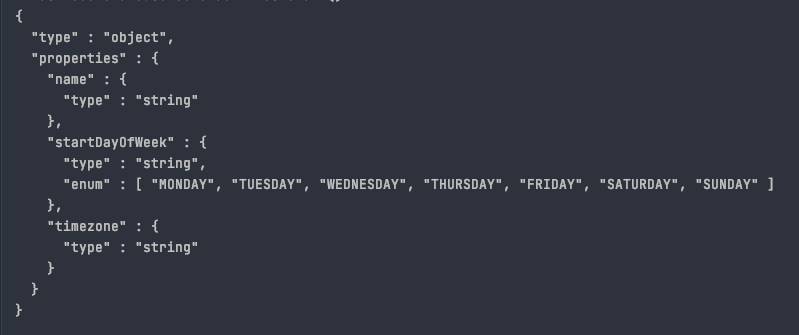

# 工程介绍
json-schema-util：
验证json是否符合schema格式；
类生成JSON scheme；

## JsonSchemaUtil介绍

JsonSchemaUtil provides json schema verification. If the verification is successful, it returns TRUE, and if the verification fails, it returns FALSE.

### 用法:
#### 用法1：
```java
String json = "{\"name\":\"TOM\",\"age\":23,\"declawed\":false,\"description\":\"TOM loves to sleep all day.\"}";

String jsonSchema = "{\"$schema\":\"http://json-schema.org/draft-04/schema#\",\"title\":\"cat\",\"properties\":{\"name\":{\"type\":\"string\"},\"age\":{\"type\":\"number\",\"description\":\"Your cat's age in years\"},\"declawed\":{\"type\":\"boolean\"},\"description\":{\"type\":\"string\"}},\"required\":[\"name\",\"age\",\"declawed\"]}";

System.out.println(JsonSchemaUtil.validate(json, jsonSchema));

```

#### 用法2：
```java
String json = "{\"name\":\"TOM\",\"age\":23,\"declawed\":false,\"description\":\"TOM loves to sleep all day.\"}";

String jsonSchema = "{\"$schema\":\"http://json-schema.org/draft-04/schema#\",\"title\":\"cat\",\"properties\":{\"name\":{\"type\":\"string\"},\"age\":{\"type\":\"number\",\"description\":\"Your cat's age in years\"},\"declawed\":{\"type\":\"boolean\"},\"description\":{\"type\":\"string\"}},\"required\":[\"name\",\"age\",\"declawed\"]}";

JsonNode jsonNode = strToJsonNode(json);

JsonNode schemaNode = strToJsonNode(jsonSchema);

System.out.println(JsonSchemaUtil.validate(jsonNode, schemaNode));
```

## GenerateJsonSchemaUtil介绍
Class生产Json schema string
### 用法：
```java
GenerateJsonSchemaUtil.classToJsonSchema(MyClass.class, true)
```


# json-schema

官网：https://json-schema.org/

# 性能
<=1ms